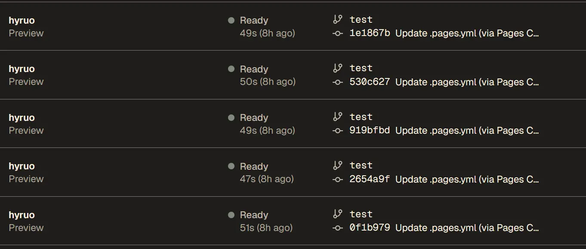

> 从 WordPress 迁移到 Hugo 后，我一直对 WordPress 后台管理以及手机 APP 的便利性念念不忘，为此我在之前也写过关于 [如何在手机上更新Hugo博客](https://hyruo.com/article/how-to-update-a-hugo-blog-on-an-android-phone/) 的文章，但是在手机上使用 Vscode 和 StackEdit 还是有点麻烦，主要是显示屏太小，一些精细化操作很难用手指触控解决。过程中我也尝试过几种 Hugo CMS 方案，但一直未满足我的需求。

* * *

## 几次失败的尝试

### Decap CMS

Decap CMS 以前又叫 Netlify CMS，看名字就知道跟 Netlify 有着很强的关联。它默认部署方式就是在 Netlify 上，但是由于我一直没能注册到 Netlify 账号，于是我只能在甲骨文服务器上进行测试。但在测试过程中，我发现它的后台配置非常麻烦，也许只有使用 Netlify 部署才能体现出它的便利性，之后我便搁置测试了。


### QUIQR

QUIQR 是一款本地化软件，可以直接在 Windows 安装。但是它并不支持 Web 版，也没有手机 APP，这就使得它没法在手机上使用。与我预期目的不符。


### Tina CMS

Tina CMS 之前又叫 Forestry CMS 也是一款无头编辑器，但我与它无缘，即便我已经设置好 Tina Cloud 账号并添加项目，但是我一直卡在本地 Tina 安装上边。不知道是我的网络问题还是怎么，我在两台电脑上都没能成功安装 Tina 程序。


* * *

## Pages CMS

Pages CMS 是 Github 上一个新的开源项目，在 0.x 版本时，可以选择在 Cloudflare 快捷部署。最近升级了 1.0 版本，默认可在 Vercel 部署。之前在 0.x 版本时我曾试过用一次，当时主要问题是该 CMS 不支持 webp 图片，我在项目提交了 issue，今早收到开发者回复说最新版本已经解决该问题。

于是兴冲冲地按文档部署了 1.0 版本，过程还是相对复杂但也顺利。可是在使用过程中，有一个问题我始终 [无法解决](https://github.com/pages-cms/pages-cms/issues/129)

> 我的 hugo 博客文件都是在 `content/posts` 下边的单个文件夹，博客图片跟 md 文件在同一个文件夹内。我好不容易解决了正文中图片的上传和引用问题，但是 front-matter 中自动生成的特色图片地址没法被 hugo 渲染。

于是我提交了这个 issue 向开发者反映。但开发者也说他自己暂时没办法解决，而且之前已经有几个人提出过类似问题，都是卡在 Hugo 的文件路径上。

见到开发者的回复后，我一度已经放弃继续使用 CMS 的想法。

> Thank you, I'm completely heartbroken. I'll just keep using some IDE tools like VSCode, but it's really inconvenient on a phone.

见到开发者回复后，我突然想到，为啥一定要将 Hugo 的特色图片路径交由 CMS 去转换呢，我自己直接输入一个路径不就解决了。

### 原方案，使用 Pages CMS 自动转换

```
media:
  input: content/posts
  output: /content/posts 
content:
     ...
      - name: image
        label: Image
        type: image
        list: true
        options:
          input: content/posts
          output: /content/posts
```

### 新方案，先设置一个图片上传区域，再自行输入特色图片地址

```
media:
  input: content/posts
  output: /content/posts 
content:
     ...
      - name: uploadimage
        label: Uploadimage
        type: object
        list: true
        fields:
          - name: newimage
            label: newimage
            type: image
            options:
              input: content/post
              output: content/post
              categories: [image]
      - { name: image, label: image, type: string, required: true }
```

这样，起码解决了 Hugo 特色图片路径错误问题。但其实也带来一个新问题，就是在 Pages CMS 后台，没法在文字编辑区看到图片内容了。在使用 `` 语法后，编辑区里图片直接消失。在添加图片名称后，稍微好点，起码知道这个位置有个图片了。


如果直接在后台按 `/` 呼出编辑器内的图片功能添加图片，虽然在编辑器内可以看到图片长啥样，但 PagesCMS 会自动匹配图片路径为 `/content/post/articl-pyth/image.webp`，也是没法用的，Hugo 构建后图片肯定挂。

但无论如何，终于算是基本搭建好一个能够给 Hugo 使用的 CMS 后台。

* * *

### Github 修改自动部署

相比 StackEdit 可以手动暂停同步的做法，PageCMS 这类程序，会在每一次保存 `.pages.yml` 文件，每一次上传图片，每一次保存文章内容的过程中都提交更新到 Github 上，这样会造成 Github Actions 或者 Cloudflare Pages, Vercel 等自动部署服务在后台不断消耗部署时长。我本以为新建一个 test 分支会避免这个问题，结果没想到还是在调试 `.pages.yml` 文件时，连续触发 Vercel 四十多次自动部署，感觉再多点账号都得被干废了。



1. **Vercel 忽略部署设置**

在 `Vercel Setting Git` 中，有一个忽略构建选项，选择 `custom` 并在其中添加如下命令即可。

```
if git log -1 --pretty=%B | grep -iqF 'webp'; then echo "🛑 - Build cancelled (commit message contains 'webp')"; exit 0; else echo "✅ - Build can proceed"; exit 1; fi
```


> 原理：在 PageCMS 中添加图片，PageCMS 会自动生成一条 `Create content/editor/2024-12-07-pages-cms-a-barely-adequate-backend-for-hugo-blog/6.webp (via Pages CMS)` 这样的提交信息，其中关键词就是图片格式了。所以在 Vcel 忽略构建命令中只要检测到提交信息包含 webp 即忽略部署（以后命名文件路径时最好就不要将 webp 写进去了）。

2.  **Github Actions 忽略部署设置**
    

相同原理，在 Workflow 的部署模板中，添加如下代码，侦测是否仅提交 webp 图片，如果是的话，不启动自动构建。但该方法似乎无效。

```
      - name: Check for non-WebP images  # 添加在 built 中
        id: check_images
        run: |
          if git diff --name-only HEAD^ | grep -vE '\.webp$' > /dev/null; then
            echo "Non-WebP images detected. Proceeding with deployment."
            echo "::set-output name=deploy::true"
          else
            echo "Only WebP images detected. Skipping deployment."
            echo "::set-output name=deploy::false"
          fi

      if: steps.check_images.outputs.deploy == 'true' # 添加在 deploy 中
```

3.  **Cloudflare Pages 忽略部署设置**
    

暂未找到合适方法。不过 Cloudflare 财大气粗，可能也不在乎多构建几次。

* * *

## PagesCMS 设置

最后传上我自己的 PagesCMS 供参考。

```
media:
  input: content/editor
  output: /content/editor
  categories: [image]
content:
  - name: editor
    label: 文章
    type: collection
    path: content/editor
    filename: index.md
    view:
      fields: [ title, date, draft ]
    fields:
      - { name: title, label: 标题, type: string, required: true }
      - { name: draft, label: 草稿, type: boolean, default: true }
      - { name: slug, label: 固定链接, type: string, required: true }
      - name: date
        label: 日期
        type: date
        options:
          format: yyyy-MM-dd'T'HH:mm:ss
          time: true
      - name: categories
        label: 分类
        type: select
        list: true
        options:
          values:
            - 生活
            - 瞬间
            - 法律
            - IT互联网
            - 社会
      - name: tags
        label: 标签
        type: string
        list:
          min: 1
          max: 6
      - name: imageupload
        label: 上传照片区域
        type: object
        list: true
        fields:
          - name: addimage
            label: 添加照片
            type: image
            options:
              input: content/editor
              output: /content/editor
              categories: [image]
      - { name: image, label: 特色图片地址, type: string, required: true }
      - { name: body, label: 正文, type: rich-text }
```