有几个月没去广州了，最近刚好有同事说还没去过广州塔，所以陪着他们一起到广州一日游。<!--more-->

说是一天吧，其实时间也不长，就沿着天河中轴线转了一下，先后去了广东省博物馆、永庆坊和广州塔。之所以最后选择去广州塔，是想着买傍晚时间的门票能够同时看到广州的日景和夜景。

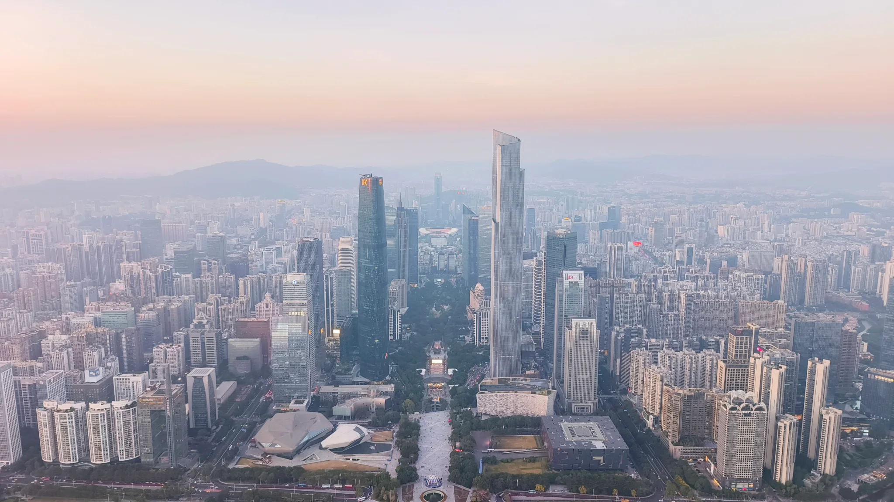

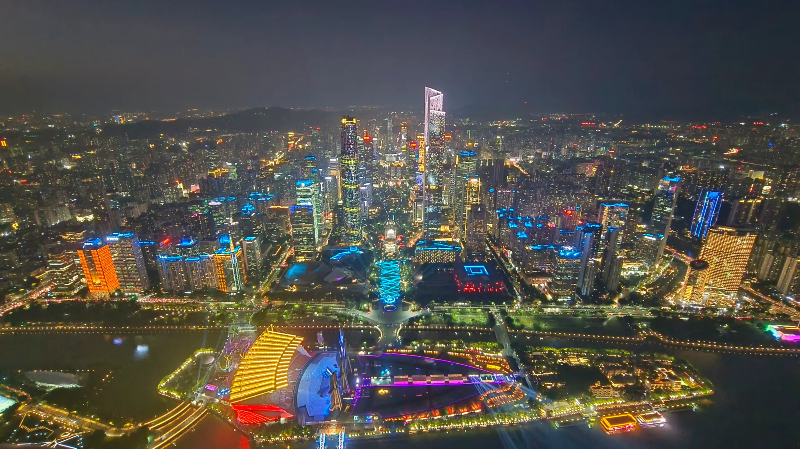

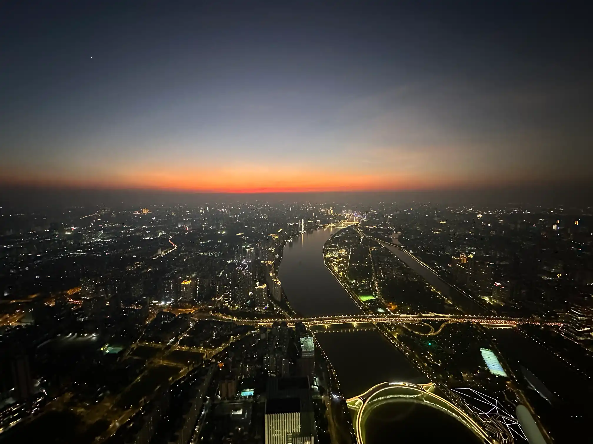

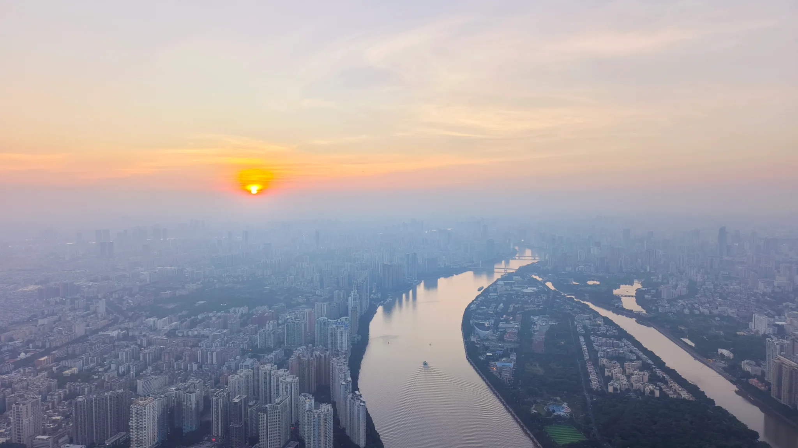

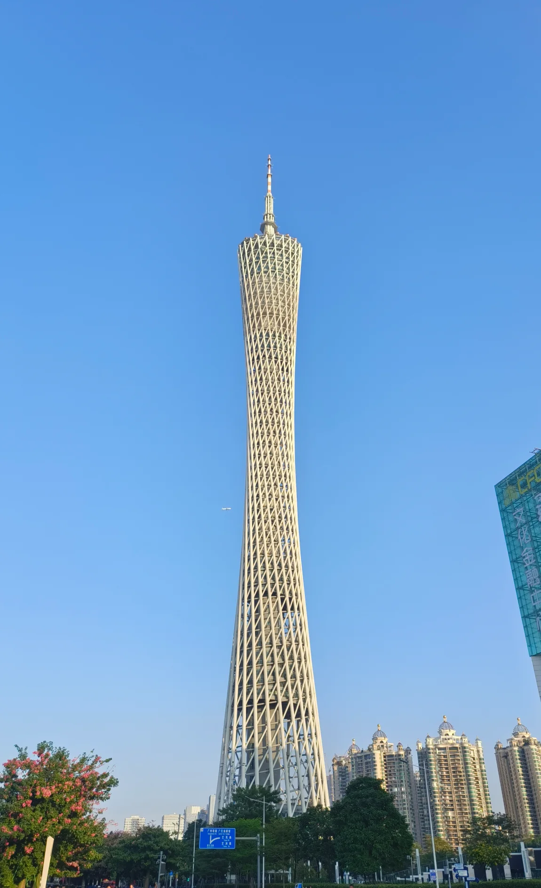

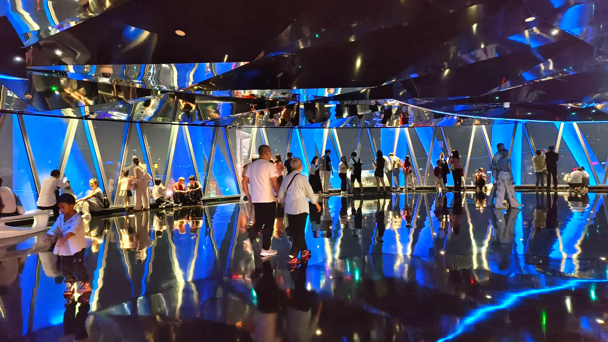

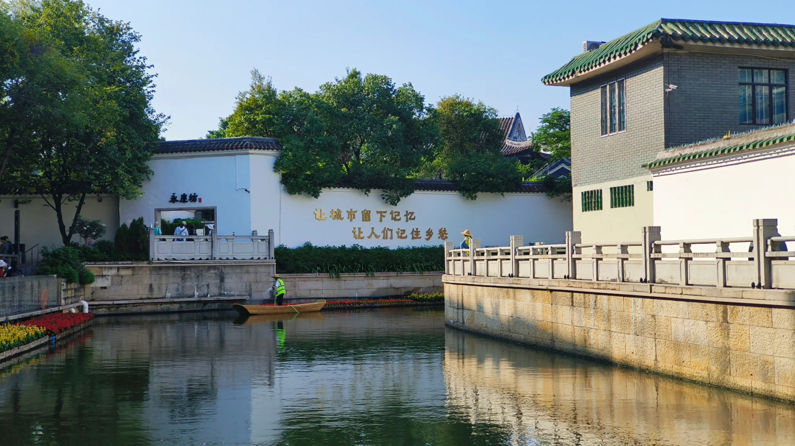

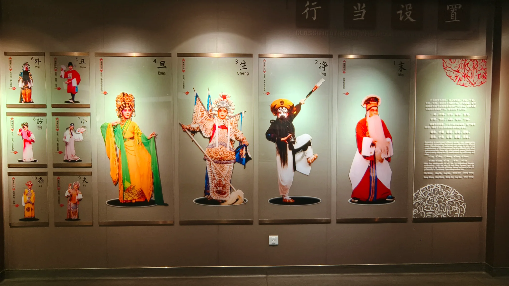

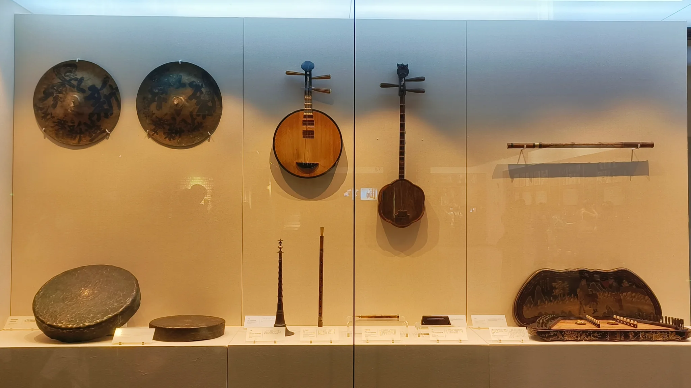

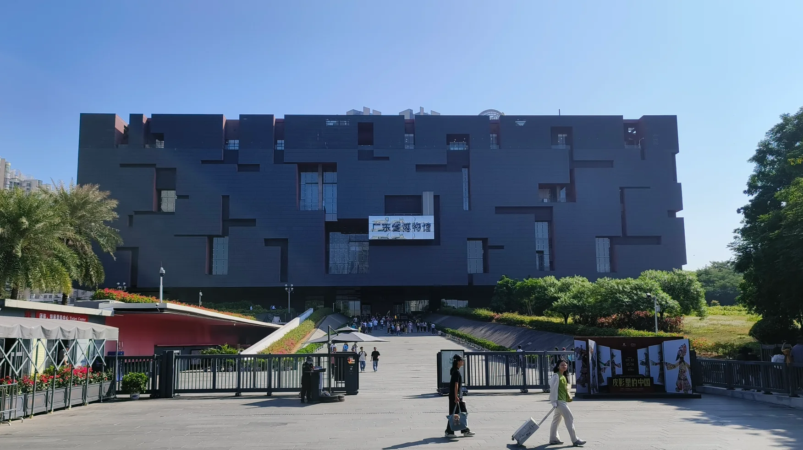

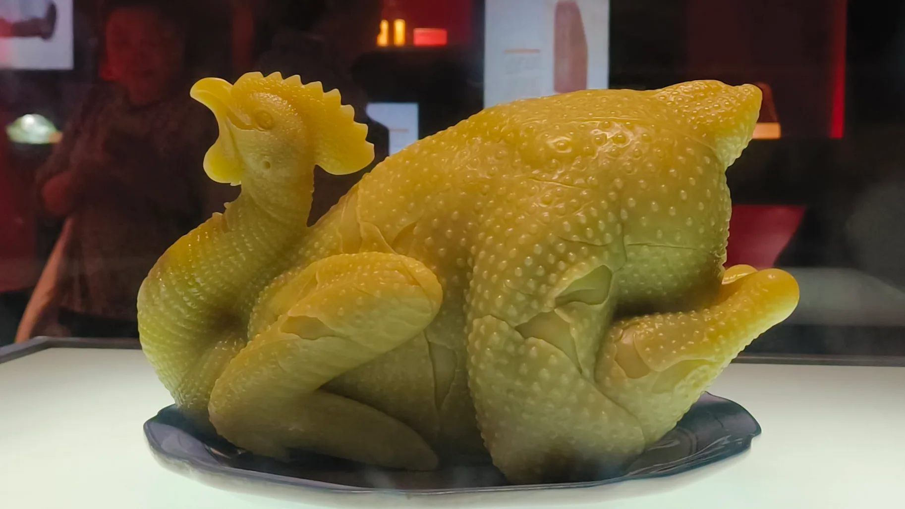

广东省博物馆算是我所去过的省级博物馆里面排名倒数第一的，实在是乏善可陈，乃至于现代工艺品都能被当成镇馆之宝。整个博物馆里面人文元素实在是过于匮乏，基本都是以近现代工艺品和自然矿产作为主角，很多人讲广东是中国的文化沙漠，恐怕也不无道理。
<!--stackedit_data:
eyJoaXN0b3J5IjpbMjgxNTUxNDA3XX0=
-->