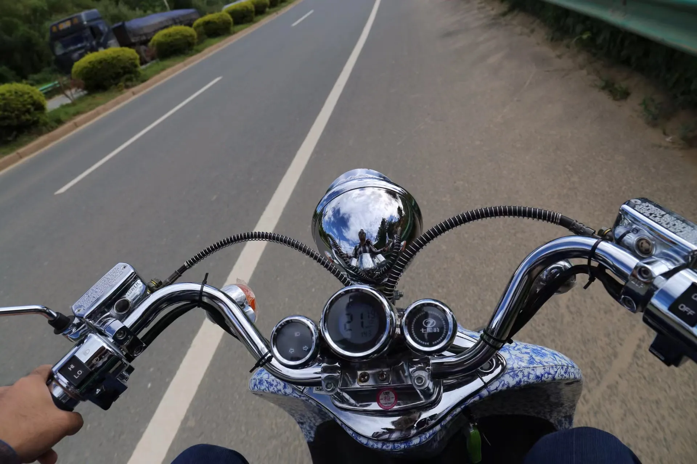
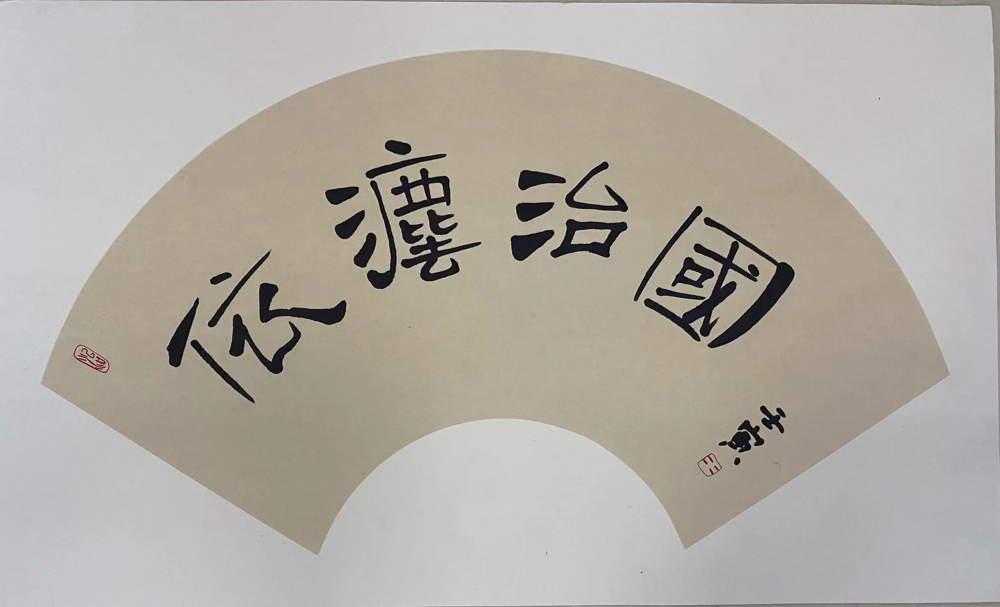
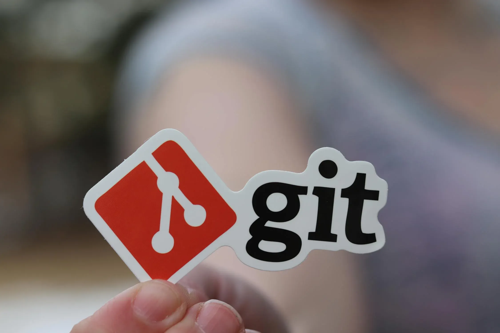

## 关于作者

| 常见个人问题      |        答案       | 
| :-----------: | :-----------: | 
| 博主哪里人？     |  湖南双峰 |
| 多大年纪？  | 生于 1989    |
| 在哪工作？  | 广东佛山      |
| 什么职业？  | 法律工作者     |
| 毕业院校？ | 佛山大学|
| 结婚没有？| 已婚二孩 |

---

## 关于本站

| 常见博客问题      |        答案       | 
| :-----------: | :-----------: | 
| 为何搞博客？  |  个人兴趣    |
| 服务器在哪？ | 托管在 Github  Gitlab  Vercel 等平台 |
| 什么网站程序？ | HUGO  `https://gohugo.io/` |
| 域名什么意思？| 女儿名字 `H. Y. Ruo` |
| 联系方式? |  `mail@hyruo.com`  |
| 微信 QQ ？| 邮件或评论联系添加 |

---

### 内容格式

1. **内容**
本站始创于 2008 年，总体内容都是以个人流水账为主。除中间个别文章为夫人所作外，其余内容基本都是个人写作。图片部分，2014 年之前配图大多数采用了 pexels 公共图库内容，少部分为个人拍摄。

2. **格式**
本网站的内容是通过一个自动化插件从 WordPress XML 文件转制成Markdown文件，但与 WordPress 相比，格式上有显著差异。如果您在浏览时遇到困难，可以在页面下方评论指出问题。

3. **双语**
由于本站内容在此前是分开部署再行合并，并且此前中文、英文内容分属不同数据结构，其中英文部分内容合并自 Wordpress，中文部分内容合并自 Hexo，因此会出现很多文章仅有英文或仅有中文的现象。如果阅读困难，可以通过浏览器上的翻译插件进行翻译，但翻译错误较多，在此说声抱歉！

> **本站上无论是英文还是中文页面，都有可能是由机器翻译而来，存在大量语法错误和翻译错误，这都是正常情况。如果因机器翻译错误导致词句意义不通顺或完全相反，还请海涵！**

---

---

## 博客历史

### 初创时期
2008 年开始在朋友推荐下将博客从牛博网搬到 Wordpress 平台，开始了独立博客生涯。期间主要是发一下大学生活感想和学习体会之类的东西，但由于学生时代思想比较左，很多东西到现在已经没法看了，所以在某次搬迁过程中，大部分内容都给删掉了。

### 摆烂阶段
刚参加工作那几年，由于年富力强、能者多劳等PUA原因，很少再更新博客，主要就是折腾各种主机、平台，期间域名换了一堆，主机换了一堆，还用“火车头”采集过很多无脑文章，文章越来越多，数据库越来越大，但自己写的东西越来越少。

### 转型阶段
2014 年开始，由于国内网络监管力度陡然升级，看着阿里云天天发过来的违规链接提示，实在是受不住，很多常用字词都被判定为违规，让人感觉无所适从。加上 Wordpress.org 访问也不稳定，于是一狠心，就把博客转到 Typecho 并整体英文化了。但由于当时国内出口带宽还不高，而且三天两头看到有朋友域名黄了，所以仍然将主机留在阿里云。

### 外迁阶段
2016 年左右，由于转型英文博客后，英文水平仍然很有限，所以日常就是随性发个图写几句话就当更新了，也没在乎过访问量啥的，毕竟 2016 年 Google PR 定级都取消了，手机互联网兴起，也没几个人继续看网页。想着保持个 1ip 博客做个念想也就没必要继续续费，于是开始折腾国外免费空间，期间由于需要适配免费空间的小数据库限制，把之前几百条日常吐槽的碎片化内容以及一些无厘头东西又给删掉了一次。

### 重构阶段
2020 年新冠疫情后，个人有了更多闲暇时间，经朋友介绍，加入了 MJJ 行列，折腾力度也是越来越大，高峰时手头一堆各种廉价VPS。这时候就是随便找个 VPS 就把博客往里放了，也没怎么管理。过程中，还尝试过 Hexo Hugo 等多个方案，但折腾来折腾去，光折腾网站框架本身去了，写作又给丢了。

### 定型阶段
到 2023 年，自己也已经接近 35 岁了，在一些行业都是开始想着退休的年龄，于是回头重构了一下博客，想着就这样定型玩下去算了，也懒得再折腾网站本身。目前主要保留两个域名，Hyruo.com 和 fosu.cc，一个是女儿名字，一个是大学英文简称，除了本博客外，部分子域名还部署了一些基本网络应用。

---

## 法律申明

本博客发布的文字作品仅供个人浏览查阅并受著作权保护，请勿复制、转载、改编。除特别标注外，本博客上所使用照片、视频和其他多媒体格式文件遵循 CC BY-NC-ND 4.0 协议。 

---

## 法律支持

* **法律帮助**
作为公职律师，虽然无法提供有偿法律服务，但如果您有相关需要，也可以向我寻求法律帮助，包括但不限于各种民事、刑事和行政问题。
* **法学研究**
作为一名法学工作者，虽然研究能力一般，但是研究热情还是很高的，如果您在法学理论和实践层面有相关疑难杂症问题，欢迎一起探讨交流。
* **行政指引**
在体制内工作多年，虽然职位普通，但大部分门路还是很熟悉，如果您在与政府部门沟通或处理政府事务时遇到困难，也可以联系我出点主意。

---

## 网站配置

本博客使用 Hugo 程序和 Stack 主题搭建，文件托管在 Github 和 Gitlab 上，并随机部署在 Github Pages, Gitlab Pages,Vercel 或者 CloudFlare Pages 等免费平台。

本博客大部分时候默认开启 Cloudflare CDN（减速 CDN），偶尔也会切换其他 CDN，如果您在中国大陆等特定地区访问，可能会出现速度拉跨甚至无法访问等现象，这都是正常的。

### 其他配置

1. **静态资源**  
字体：`HarmonyOS_Regular`  
字体 CDN: `s1.hdslb.com/bfs/static/jinkela/long/font/regular.css`    
CSS/JS CDN： `cdn.jsdmirror.com` （ jsDelivr 平替）  

2. **图片 CDN**  
公益博客 CDN : `blogcdn.net`  

3. **评论 Twikoo**  
部署： `MongoDB Atlas + Vercel`   
解析 : `vercel.cdn.yt-blog.top`（优选 Vercel IP）   

4. **图片素材**  
共享图片：`www.pexels.com` ( CC 协议)    
共享图片：`openverse.org` ( CC 协议)   

5. **图标 icons**  
图标：`tablericons.com`  

如有其他疑问请联系：`mail@hyruo.com`